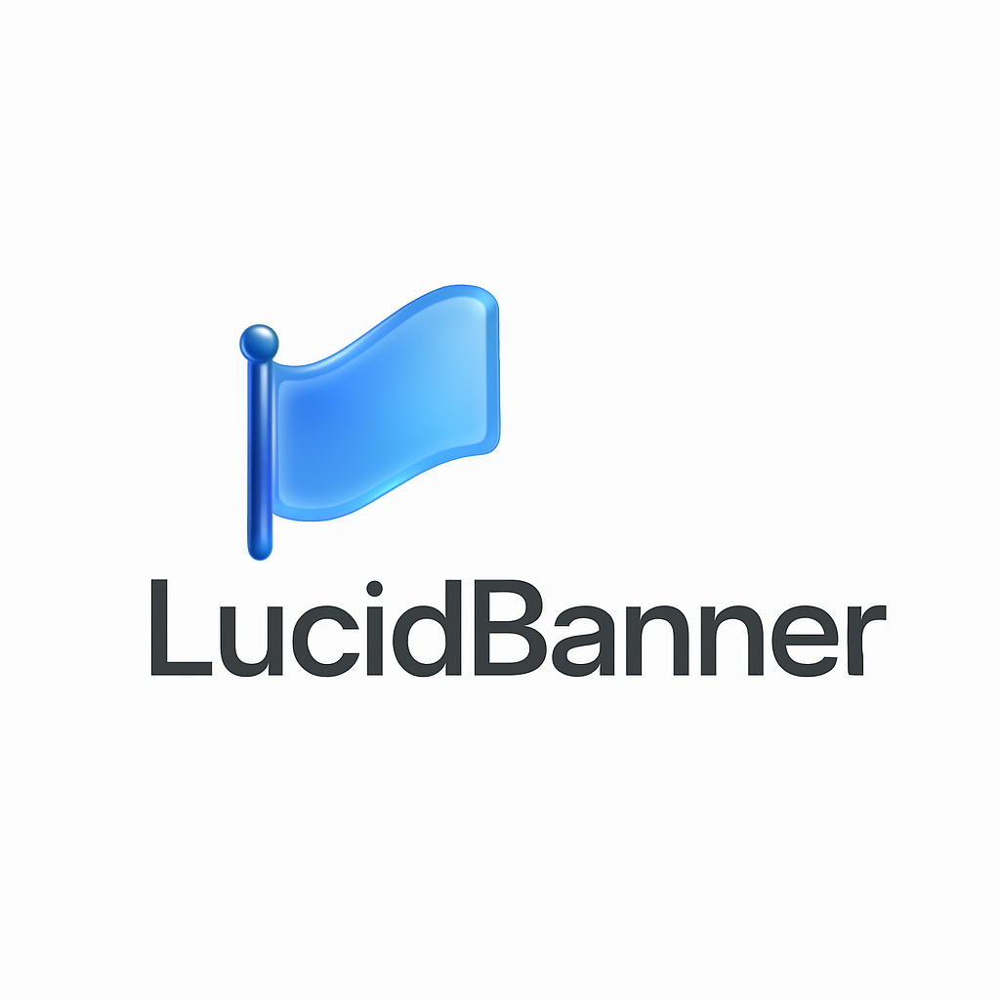

<div align="center">
    
</div>

SwiftUI-based transient banners rendered in their own `UIWindow` above the status bar.

- No intrusive HUDs
- Scene-aware (iPad / multi-window)
- Queueable, updatable, dismissable

Originally developed for the **Nextcloud iOS** app.  
Author: **Marino Faggiana** • License: **MIT** • Version: **0.0.1**

---

### 🚧 Work in Progress

LucidBanner is currently under **active development**.  
While functional, the library should be considered **experimental**, and its APIs may change as development continues.  
Production use is not recommended until a stable 1.0 release.

## Features

- **One-at-a-time display** with queueing policies:
  - `.enqueue` – queue new banners
  - `.replace` – dismiss current and show the new one
  - `.drop` – ignore the new request if something is already visible
- **Flexible layout**
  - Vertical: `.top`, `.center`, `.bottom`
  - Horizontal: `.left`, `.center`, `.right`
  - Safe-area aware margins
- **Interaction**
  - Swipe-to-dismiss (direction-aware based on position)
  - Optional scrim that blocks touches behind the banner
  - Tap callback: `onTap(token, stage)`
- **Live updates**
  - `update(...)` for title / subtitle / footnote / icon / animation / progress / stage
- **Lifecycle**
  - Optional auto-dismiss timer
  - Simple `isAlive(token)` check
  - Works with multiple scenes (`UIWindowScene`) on iPhone/iPad (iOS 17+)

---

## Requirements

- iOS 17.0+
- Swift 6.0+
- SwiftUI + UIKit

---

## Installation (Swift Package Manager)

### Xcode

1. `File → Add Packages…`
2. Enter the repository URL:
   ```
   https://example.com/your-org/LucidBanner.git
   ```
3. Choose tag **0.0.1**
4. Add **LucidBanner** to your target

### Package.swift

```swift
dependencies: [
    .package(url: "https://example.com/your-org/LucidBanner.git", from: "0.0.1")
]
```

---

## Quick Start

```swift
import SwiftUI
import LucidBanner

struct ContentView: View {
    @State private var token: Int = 0

    private var currentWindowScene: UIWindowScene? {
        UIApplication.shared.connectedScenes
            .compactMap { $0 as? UIWindowScene }
            .first { $0.activationState == .foregroundActive }
    }

    var body: some View {
        VStack(spacing: 16) {
            Button("Show Top Banner") {
                guard let scene = currentWindowScene else { return }

                token = LucidBanner.shared.show(
                    scene: scene,
                    title: "Upload started",
                    subtitle: "Keep the app active for best performance",
                    systemImage: "arrow.up.circle",
                    imageAnimation: .breathe,
                    vPosition: .top,
                    autoDismissAfter: 3.0,
                    onTap: { token, stage in
                        print("Banner tapped: token = \(token), stage = \(stage ?? "nil")")
                    }
                ) { state in
                    ToastBannerView(state: state)
                }
            }

            Button("Update Progress") {
                LucidBanner.shared.update(
                    progress: 0.66,
                    stage: "uploading",
                    for: token
                )
            }

            Button("Dismiss") {
                LucidBanner.shared.dismiss(for: token)
            }
        }
        .padding()
    }
}
```

SwiftUI banner example:

```swift
struct ToastBannerView: View {
    @ObservedObject var state: LucidBannerState

    var body: some View {
        HStack(spacing: 12) {
            if let systemImage = state.systemImage {
                Image(systemName: systemImage)
                    .font(.system(size: 20, weight: .semibold))
            }

            VStack(alignment: .leading, spacing: 2) {
                if let title = state.title {
                    Text(title)
                        .font(.headline)
                }
                if let subtitle = state.subtitle {
                    Text(subtitle)
                        .font(.subheadline)
                        .foregroundStyle(.secondary)
                }
                if let footnote = state.footnote {
                    Text(footnote)
                        .font(.footnote)
                        .foregroundStyle(.secondary)
                }
                if let progress = state.progress {
                    ProgressView(value: progress)
                        .progressViewStyle(.linear)
                }
            }

            Spacer()
        }
        .padding(12)
        .background(.regularMaterial, in: RoundedRectangle(cornerRadius: 14))
        .shadow(radius: 12, y: 4)
    }
}
```

---

## License

MIT License. See `LICENSE` file.
